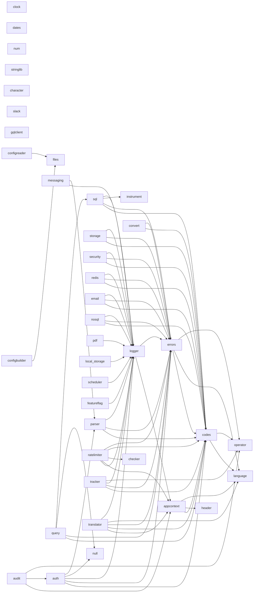

# Dependency Graph

> Documents how packages depend on each other inside this monorepo, and what third-party libraries each one pulls in. Derived from `import` statements in non-test `.go` files. Re-generate after major refactors by grepping `github.com/downsized-devs/sdk-go/` across each package's main files.

## Visual graph (Mermaid)



## Dependency matrix (internal)

Each row lists the **direct** sibling packages a given package imports.

| Package | Internal sdk-go imports |
|---|---|
| appcontext | codes, header, language |
| audit | appcontext, auth, operator |
| auth | codes, errors, logger, null, parser |
| character | — |
| checker | — |
| clock | — |
| codes | language, operator |
| configbuilder | files |
| configreader | files |
| convert | codes, errors |
| dates | — |
| email | codes, errors, logger |
| errors | codes, language, operator |
| featureflag | logger |
| files | — |
| generator | (internal subpackages only) |
| gqlclient | — |
| header | — |
| instrument | — |
| language | — |
| local_storage | logger |
| logger | appcontext, errors |
| messaging | logger, parser |
| nosql | codes, errors, logger |
| null | — |
| num | — |
| operator | — |
| parser | codes, errors, logger |
| pdf | logger |
| query | codes, errors, null, sql |
| ratelimiter | logger, appcontext, checker, codes, errors |
| redis | codes, errors, logger |
| scheduler | logger |
| security | codes, errors, logger |
| slack | — |
| sql | codes, errors, instrument, logger |
| storage | codes, errors, logger |
| stringlib | — |
| tests | — (mock helpers only; no top-level `.go` files) |
| tracker | codes, errors, logger, operator |
| translator | appcontext, codes, errors, language, logger |

## External dependency matrix

Major third-party libraries per package (stdlib excluded).

| Package | External deps |
|---|---|
| audit | `github.com/rs/zerolog` |
| auth | `firebase.google.com/go`, `google.golang.org/api/identitytoolkit/v3`, `google.golang.org/api/option` |
| character | `golang.org/x/text/cases`, `golang.org/x/text/language` |
| configbuilder | `github.com/cbroglie/mustache`, `github.com/spf13/viper` |
| configreader | `github.com/mitchellh/mapstructure`, `github.com/spf13/viper` |
| convert | `github.com/cstockton/go-conv` |
| email | `gopkg.in/gomail.v2`, `github.com/Boostport/mjml-go` |
| featureflag | `github.com/thomaspoignant/go-feature-flag` |
| instrument | `github.com/prometheus/client_golang` |
| local_storage | `github.com/blevesearch/bleve` |
| logger | `github.com/rs/zerolog` |
| messaging | `firebase.google.com/go`, `firebase.google.com/go/messaging`, `google.golang.org/api/option` |
| nosql | `go.mongodb.org/mongo-driver` |
| num | `github.com/xuri/excelize/v2` |
| parser | `github.com/json-iterator/go`, `github.com/xeipuuv/gojsonschema`, `github.com/gocarina/gocsv` |
| pdf | `github.com/pdfcpu/pdfcpu` |
| query | `github.com/jmoiron/sqlx` |
| ratelimiter | `github.com/gin-gonic/gin`, `github.com/ulule/limiter/v3` |
| redis | `github.com/go-redis/redis/v8`, `github.com/bsm/redislock` |
| scheduler | `github.com/go-co-op/gocron/v2` |
| security | `golang.org/x/crypto` (`pbkdf2`, `scrypt`) |
| slack | `github.com/slack-go/slack` |
| sql | `github.com/jmoiron/sqlx`, `github.com/go-sql-driver/mysql`, `github.com/lib/pq`, `modernc.org/sqlite` |
| storage | `github.com/aws/aws-sdk-go` |
| tracker | `github.com/prometheus/client_golang`, `github.com/prometheus/common` |
| translator | `github.com/go-playground/locales`, `github.com/go-playground/universal-translator` |

Packages not listed have no third-party imports (stdlib only).

## Critical paths (most-depended-upon)

In-degree counted across the matrix above:

| Package | Used by N siblings | Implications |
|---|---|---|
| `logger` | 16 | Any breaking change cascades across the SDK. Treat its `Interface` as a public API freeze. |
| `codes` | 15 | Code values are part of the public contract; **never re-number existing codes**. |
| `errors` | 14 | `errors.GetCode`, `NewWithCode`, `WrapWithCode` are load-bearing. |
| `appcontext` | 4 | Context keys are private — safe to extend with new getters/setters. |
| `language` | 4 | Locale constants. Add new locales additively. |
| `operator` | 4 | Generic `Ternary` is widely inlined; stable. |
| `parser` | 2 | JSON parsing is on every HTTP edge. |
| `null` | 2 | Used by `auth` and `query`. |
| `files` | 2 | Used by both config packages. |
| `auth` | 1 | Used by `audit`. |
| `checker` | 1 | Used by `ratelimiter`. |
| `header` | 1 | Used by `appcontext`. |
| `instrument` | 1 | Used by `sql`. |
| `sql` | 1 | Used by `query`. |

Counts verified 2026-05-15 by grep across non-test files.

## Circular dependencies

None detected. The graph is a DAG — `logger → appcontext → codes → language/operator` is the deepest internal chain. `logger` deliberately imports `appcontext` and `errors`, both of which sit below it; neither imports back into `logger`.

## How to verify this document

```bash
# Spot-check internal imports for a single package
grep -rh '"github.com/downsized-devs/sdk-go/' redis/*.go \
    | grep -v _test.go | sort -u

# Spot-check the entire graph
for d in */; do
    pkg="${d%/}"
    [ -f "$d/go.mod" ] && continue
    imports=$(grep -rh '"github.com/downsized-devs/sdk-go/' "$d"/*.go 2>/dev/null \
        | grep -v _test.go \
        | sed -E 's|.*sdk-go/([^/"]+).*|\1|' | sort -u | tr '\n' ',')
    echo "$pkg: $imports"
done
```

## See also

- [PACKAGE_REGISTRY.md](./PACKAGE_REGISTRY.md) — package catalogue.
- [STABILITY.md](../STABILITY.md) — what we promise about changes to critical-path packages.
- [CONTRIBUTING.md](../CONTRIBUTING.md) — rules for adding dependencies.
